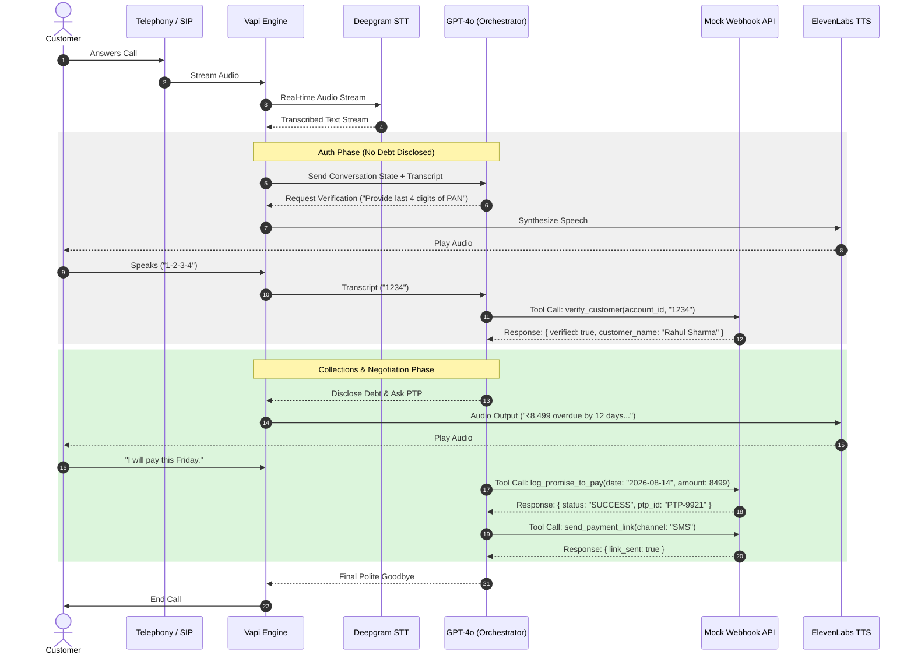

# High-Level Design Document
## Outbound Collections Voice Agent — "Maya"

**Prepared for:** Kapture Finance  
**Author:** Ramya  
**Date:** August 2026

---

## 1. Architecture & Pipeline

Maya is built on Vapi.ai as the real-time voice orchestration layer, which coordinates speech-to-text, the LLM orchestrator, text-to-speech, and telephony. Vapi also routes structured tool calls to an external webhook (a Node.js/Express server) that simulates Kapture Finance's backend systems (CRM, payment gateway, disposition logging).

### 1.1 Pipeline Flow

**Telephony (SIP/PSTN or Web Call) → Speech-to-Text (Deepgram Nova-2) → Orchestrator / LLM (GPT-4o-mini, temperature 0.1) → Text-to-Speech (ElevenLabs Flash v2.5) → Telephony Output**

In parallel, the LLM orchestrator issues tool calls (function calls) to a mock Express webhook whenever it needs to verify identity, log a promise-to-pay, trigger a payment link, escalate, or record a disposition. The webhook responds synchronously, and the LLM must wait for that response before narrating any outcome to the customer — this rule was added after testing surfaced a case where the agent verbally claimed a payment link had been sent before the tool actually returned (see Section 6.3).

### 1.2 Latency Budget

| Hop | Component | Target Latency | Notes |
|---|---|---|---|
| 1 | Telephony / Network | ~200ms | SIP/PSTN or WebRTC transport overhead |
| 2 | STT (Deepgram Nova-2) | ~200ms | Streaming transcription, optimized for telephony audio |
| 3 | LLM First Byte (GPT-4o-mini) | ~400ms | Low temperature (0.1) for deterministic, rule-following output |
| 4 | TTS (ElevenLabs Flash v2.5) | ~300ms | Flash model chosen specifically for low-latency conversational use over higher-fidelity Multilingual v2 |
| **Total** | **End-to-End Round Trip** | **< 1.2s target** | Vapi's own orchestration layer advertises ~560ms typical, leaving headroom for STT + TTS |

---

## 2. Conversation State Machine

Authentication is state-enforced, not prompt-discretionary: the system prompt explicitly forbids any transition into the disclosure state until the `verify_customer` tool has returned `verified: true`. This was validated in live testing — when verification failed, Maya did not disclose any debt information, even after several retries (see Section 7, Test Log).

| State | Description | Exit Condition |
|---|---|---|
| **INIT** | Call connects; Maya greets and confirms she is speaking with the target customer. | Customer confirms identity claim → `AUTH_PENDING`. Customer denies → `WRONG_PERSON` disposition → `CALL_ENDED`. |
| **AUTH_PENDING** | Maya requests last 4 digits of PAN or year of birth. No debt-related terms may be used. | `verify_customer` tool returns `verified: true` → `AUTHENTICATED`. Returns `false` → retry (max 3) → escalate or end. |
| **AUTHENTICATED** | Debt is disclosed for the first time: amount, loan type, days overdue. | Customer states intent (pay / already paid / hardship / dispute / DNC) → `NEGOTIATION`. |
| **NEGOTIATION** | Maya branches based on customer intent and captures relevant entities (PTP date, amount, hardship reason, dispute notes). | Correct tool call fires (`log_promise_to_pay` / `mark_disposition` / `escalate_to_agent`) → `PTP_COLLECTED` or `ESCALATED`. |
| **PTP_COLLECTED** | Promise-to-pay logged; payment link dispatch attempted. | `send_payment_link` tool confirms success → `CALL_ENDED`. |
| **ESCALATED** | Hardship or dispute case handed to `escalate_to_agent` tool. | Escalation acknowledged → `CALL_ENDED`. |
| **CALL_ENDED** | `mark_disposition` is called with a final status; Maya delivers closing line. | Terminal state. |

---

## 3. Intents & Entities

### 3.1 Intents

| Intent | Trigger Example | Resulting Action |
|---|---|---|
| `Confirm_Identity` | "Yes, speaking." | Proceeds to `AUTH_PENDING` |
| `Promise_To_Pay` | "I can pay this Friday." | `log_promise_to_pay` + `send_payment_link` |
| `Already_Paid` | "I already paid via UPI yesterday." | `mark_disposition(ALREADY_PAID)` |
| `Hardship_Claim` | "I lost my job, I can't pay right now." | `escalate_to_agent(HARDSHIP_REQUEST)` |
| `Dispute_Debt` | "This isn't my loan." | `escalate_to_agent(DISPUTE)` |
| `Request_DNC` | "Stop calling me, put me on do-not-call." | `mark_disposition(DO_NOT_CALL)`, immediate end |
| `Wrong_Person` | "No, this isn't Rahul, and he's unavailable." | `mark_disposition(WRONG_PERSON)`, no debt disclosed |

### 3.2 Entities Extracted

| Entity | Type | Example |
|---|---|---|
| `Verification_Code` | String | "1234" (last 4 PAN digits or birth year) |
| `PTP_Date` | ISO-8601 Date | 2026-08-21 |
| `PTP_Amount` | Number | 8499 |
| `Hardship_Reason` | String | "Recently lost job" |

---

## 4. Tool / API Specifications

Five tools are registered on the Vapi assistant, each pointing to the same mock Express webhook (`POST /webhook`), dispatched by a `name` field in the request body. Full JSON schemas are versioned separately in `vapi/tool_definitions.json`.

| Tool | Inputs | Output |
|---|---|---|
| `verify_customer` | `account_id`, `verification_code` | `{ verified: bool, message }` |
| `log_promise_to_pay` | `account_id`, `ptp_date`, `amount` | `{ success, ptp_id, confirmed_date, amount }` |
| `send_payment_link` | `account_id`, `channel` (SMS/WhatsApp/BOTH) | `{ success, message }` |
| `escalate_to_agent` | `account_id`, `reason` (HARDSHIP_REQUEST/DISPUTE) | `{ success, escalation_id, reason }` |
| `mark_disposition` | `account_id`, `status` (enum), `notes` | `{ success, disposition_logged, timestamp }` |

---

## 5. Authentication & Data Safety Protocols

- **Zero third-party disclosure:** no mention of "overdue", "loan", "EMI", "amount", or the company name in a debt context until `verify_customer` returns `verified: true`.
- **Code-gated verification:** last 4 digits of PAN or birth year — not name-gated. Simply confirming a name is not sufficient to unlock disclosure.
- **PII masking:** in a production system logs would mask PII (e.g. "Rahul S****"); the current mock server logs full test values for debugging only and would need masking before real deployment.
- **Retry limit:** on failed verification (tested up to 3 attempts) before the call moves to a graceful technical-difficulty close rather than looping indefinitely.

---

## 6. Guardrails & Compliance

### 6.1 Fair Collections Norms

- Calling window restricted to 08:00–19:00 local time (enforced at the dialer/scheduling layer, outside Maya's own logic).
- Mandatory self, company, and purpose disclosure at call start.
- No threats, harassment, or repeated pressure — tone is fixed as calm, firm, and respectful in the system prompt.
- Instant opt-out: a do-not-call request is honored immediately and logged, not negotiated against.

### 6.2 Hallucination Prevention

- Maya cannot offer unauthorized waivers or discounts beyond what's explicitly scripted.
- Maya cannot claim an action occurred (payment link sent, PTP logged, escalation made) unless the corresponding tool has returned a successful result.

### 6.3 Bug Found & Fixed During Testing

> During Test 1 (see Section 7), Maya verbally confirmed that a payment link had been sent, but the `send_payment_link` tool never actually fired — confirmed by checking mock server logs. The original system prompt instructed the agent to "confirm link sent" as a narrative step, without explicitly requiring the tool result first. The prompt was revised to add a standalone rule: the agent must not state that an action occurred unless the specific tool call returned a successful result, and each Branch A step now explicitly says to wait for the tool result before proceeding. Retesting (Test 2) confirmed all four tools fired in the correct sequence with no false claims.

---

## 7. Edge Cases Matrix & Test Results

The table below reflects scenarios actually executed against the live Vapi assistant and mock webhook, not just theoretical design. Full transcripts are kept in `tests/manual_test_log.md`.

| Edge Case | Expected Behavior | Status |
|---|---|---|
| Happy path (PTP) | Auth → disclosure → PTP captured → payment link sent → disposition logged | ✅ Tested — Pass |
| Already paid | Ask for payment mode/date, log `ALREADY_PAID`, do not re-demand payment | ✅ Tested — Pass |
| Do-not-call request | Immediate `mark_disposition(DO_NOT_CALL)` and call ends without further negotiation | ✅ Tested — Pass |
| Wrong person | `mark_disposition(WRONG_PERSON)`; debt never disclosed at any point | ✅ Tested — Pass |
| Failed verification / retries | No disclosure occurs even after multiple failed attempts; graceful technical-difficulty close | ✅ Tested — Pass |
| Hardship claim | Empathetic response, `escalate_to_agent(HARDSHIP_REQUEST)` | ✅ Tested — Pass |
| Dispute amount | Escalate to resolution desk via `escalate_to_agent(DISPUTE)` | ✅ Tested — Pass |
---

## 8. Escalation & Disposition

Every call terminates in exactly one logged disposition via `mark_disposition`, ensuring no call is left in an ambiguous state. Escalation to a human agent (via `escalate_to_agent`) is reserved for hardship and dispute cases — both are outside what a compliant automated agent should resolve unilaterally, since they involve either financial distress judgment calls or a contested debt that needs human review.

| Disposition Status | Meaning |
|---|---|
| `PTP_AGREED` | Customer committed to a payment date and amount |
| `ALREADY_PAID` | Customer claims payment already made; needs backend reconciliation |
| `DISPUTED` | Customer disputes the debt; escalated to resolution desk |
| `HARDSHIP_ESCALATED` | Customer cannot pay; escalated for human review of options |
| `WRONG_PERSON` | Target customer not reached; no debt disclosed |
| `DO_NOT_CALL` | Customer opted out; must be honored on future calls |
| `NO_RESPONSE` | Silence / voicemail / no meaningful input after re-prompts |

---

## 9. Observability Metrics

| Metric | Definition | Why It Matters |
|---|---|---|
| **Containment Rate** | % of calls resolved without human escalation | Measures how much of the collections workload Maya can handle autonomously |
| **PTP Rate** | % of calls ending in a valid, logged promise-to-pay | Core business KPI — direct proxy for collections effectiveness |
| **First Call Resolution (FCR)** | % of calls ending in a clean, valid disposition (any terminal status, not left hanging) | Signals whether the agent handles the full conversation without breaking down |
| **Average End-to-End Latency** | Mean round-trip time per turn (STT+LLM+TTS+network) | Directly affects how natural the conversation feels; target < 1.2s |
| **Tool Call Failure Rate** | % of tool calls that error or time out (e.g. the 404 webhook misconfiguration hit during development) | Early warning for backend/webhook reliability issues |
| **Verification Failure Rate** | % of calls where `verify_customer` fails on first attempt | Could indicate a UX issue in how the verification prompt is worded, or fraud attempts |

---

## 10. Appendix — Sequence Diagram

The diagram below mirrors the sequence actually observed in live test calls: greeting → verification → (gated) disclosure → negotiation → tool execution → disposition → close.

**Phase 1 — Verify Identity** (no debt mentioned yet)
1. Maya asks for ID (PAN digits / birth year)
2. Maya checks the ID with the backend
3. Backend confirms: "Yes, this is Rahul"

**Phase 2 — Reveal Debt & Negotiate**

4. Maya reveals: "₹8,499 overdue, 12 days"
5. Customer responds (will pay / already paid / dispute / etc.)
6. Maya logs the outcome (promise to pay, dispute, etc.)

**Phase 3 — Close the Call**

7. Maya records the final outcome
8. Maya says goodbye and ends the call

*Matches the real happy-path test call (see Section 7)*